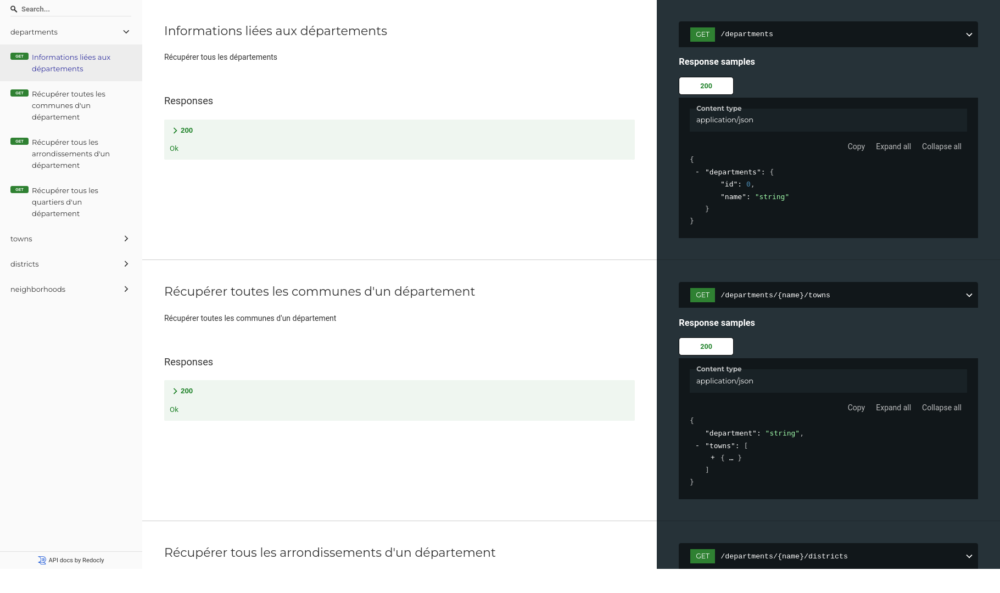

# bj-decoupage-territorial

[API](https://bj-decoupage-territorial.herokuapp.com/) (non officielle) pour obtenir des informations de base sur les départements, communes, arrondissements et les quartiers du Bénin. Elle s'inspire du fichier du découpage territorial du Bénin proposé par [leplutonien](https://github.com/leplutonien/decoupage_territorial_benin).

Ce projet est une migration de l'ancienne [version](https://github.com/nioperas06/bj-decoupage-territorial) qui utilisait une version obsolète d'AdonisJS 5 vers une version plus récente (^6.2.2).

[](https://github.com/jsbenin/bj-decoupage-territorial)


# Stack Technique
* [Node.js](https://nodejs.org/en/) ( [AdonisJS](https://adonisjs.com/) 😏 ) pour l'API
* [SQLite](https://www.mysql.com/) pour stocker les données
* [Aglio](https://github.com/danielgtaylor/aglio) & [API Blueprint](https://apiblueprint.org/) pour la doc de l'API

# Tu as envie de donner un coup de pouce?
> Bah il y a beaucoup à faire 😁
* [ ] Ecrire les tests ( C'est con, mais c'est utile 😛 )
* [ ] Améliorer la doc 📚 
* [ ] Rajouter des nouvelles infos, donc écrire du code 🏄
* [ ] Mettre un petit star ⭐️ à ce dépôt.
* N'oublie pas de nous suivre sur [Twitter](https://twitter.com/jsbenincommunity) 👊!

### Installation
```bash 
git clone https://github.com/jsbenin/bj-decoupage-territorial
```
```bash
cd bj-decoupage-territorial && pnpm install 
```

```bash
cp .env.example .env
node ace generate:key
```

```bash
# Create sqlite db
touch tmp/db.sqlite3
```

```bash
# start the project
pnpm run dev
```


# Utilisé par :
* [Portail National des services publics du Bénin](https://service-public.bj)

# License
[MIT License](LICENSE.md)
